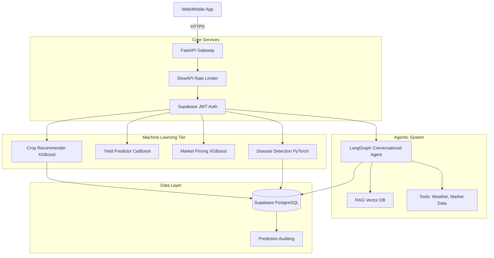

# 🌱 AI Farming Assistant Backend

An enterprise-grade, ML-powered smart farming API built with FastAPI, LangGraph, and Supabase. This system provides real-time crop recommendations, disease detection (via PyTorch), market price forecasting, and a conversational Agronomy Agent.

---

## 🏗️ Architecture



---

## 🚀 Features

- **6 Predictive ML Models**: In-memory optimized inference for crops, yield, fertilizers, diseases, pest risk, and market prices.
- **Conversational Agent**: LangGraph-based RAG assistant aware of Indian farming context and government schemes.
- **Production Hardened**: 
  - IP-based rate-limiting (`slowapi`)
  - Full prediction auditing to PostgreSQL
  - Graceful fallbacks for missing ML models
  - 100% async non-blocking design
- **Scalable**: Dockerized multi-stage build designed for Hugging Face Spaces.

---

## 💻 Local Setup (Development)

### Prerequisites
- Python 3.10+
- A Supabase Project (for DB and Auth)
- API Keys: Google Gemini (for Agent) and OpenWeatherMap

### Installation

1. **Clone & Virtual Environment**
   ```bash
   git clone https://github.com/yourusername/farming-assistant.git
   cd farming-assistant/backend
   python -m venv venv
   source venv/bin/activate
   ```

2. **Install Dependencies**
   ```bash
   pip install -r requirements.txt
   ```

3. **Environment Configuration**
   Copy the example env file and fill in your keys:
   ```bash
   cp .env.example .env
   ```

4. **Run the Server**
   ```bash
   uvicorn app.main:app --reload --port 8000
   ```
   *The API documentation will be available at `http://localhost:8000/docs`.*

---

## 🐳 Docker Deployment

The system is optimized for containerized deployment (e.g., Hugging Face Spaces or AWS EC2).

```bash
docker-compose up -d --build
```

---

## 🧪 Testing

We use `pytest` with isolated test databases and mocked auth.
```bash
pytest tests/ -v
```

---

## 🔌 API Usage Examples

### 1. Crop Recommendation
```bash
curl -X POST "http://localhost:8000/api/v1/crop/recommend" \
     -H "Content-Type: application/json" \
     -H "Authorization: Bearer <SUPABASE_JWT>" \
     -d '{
           "nitrogen": 90,
           "phosphorus": 42,
           "potassium": 43,
           "temperature": 20.8,
           "humidity": 82.0,
           "ph": 6.5,
           "rainfall": 202.9,
           "soil_type": "Loamy",
           "latitude": 19.0,
           "longitude": 73.0
         }'
```

### 2. Disease Detection (Image Upload)
```bash
curl -X POST "http://localhost:8000/api/v1/disease/analyze" \
     -H "Authorization: Bearer <SUPABASE_JWT>" \
     -H "Content-Type: multipart/form-data" \
     -F "file=@/path/to/infected_leaf.jpg"
```

### 3. Talk to the AI Agronomist
```bash
curl -X POST "http://localhost:8000/api/v1/chat/invoke" \
     -H "Content-Type: application/json" \
     -d '{
           "message": "My rice crop has brown spots with grey centers on the leaves. What is it?",
           "crop_context": "Rice",
           "location": "Punjab"
         }'
```
# deployed

