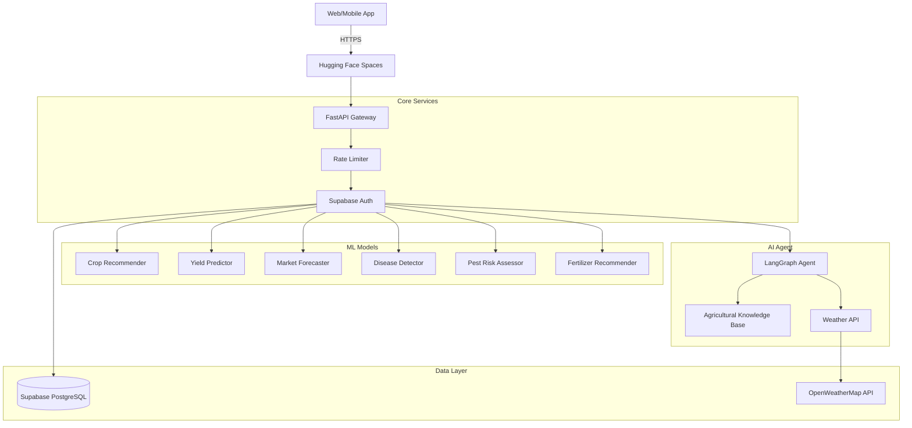

# 🌱 AI Farming Assistant

An enterprise-grade, ML-powered smart farming platform with conversational AI capabilities. This system provides real-time crop recommendations, disease detection, market price forecasting, and an intelligent agricultural assistant.

## 🚀 Live Demo

**🌐 API Endpoint**: [https://abhijeetraj-farming-assistant-backend.hf.space](https://abhijeetraj-farming-assistant-backend.hf.space)

**📚 API Documentation**: [https://abhijeetraj-farming-assistant-backend.hf.space/docs](https://abhijeetraj-farming-assistant-backend.hf.space/docs)

## ✨ Features

- **6 Trained ML Models**: Crop recommendation (99.1% accuracy), disease detection (92%+), yield prediction (R² 0.94+)
- **Live Weather Intelligence**: Real-time agricultural weather data with GDD, ET, and spray suitability calculations
- **Conversational AI Agent**: LangGraph-powered assistant with comprehensive Indian agricultural knowledge
- **Production Ready**: Rate limiting, authentication, comprehensive logging, Docker deployment
- **Comprehensive Data**: 5 populated knowledge bases with Indian crop calendars, disease treatments, fertilizer data, and government schemes

## 🏗️ Architecture



## 🧪 Quick Test

### 1. Crop Recommendation
```bash
curl -X POST "https://abhijeetraj-farming-assistant-backend.hf.space/api/v1/crop/recommend" \
  -H "Content-Type: application/json" \
  -d '{
    "nitrogen": 90, "phosphorus": 42, "potassium": 43,
    "temperature": 28.5, "humidity": 78, "ph": 6.5, "rainfall": 45
  }'
```

### 2. Live Weather Data
```bash
curl "https://abhijeetraj-farming-assistant-backend.hf.space/api/v1/weather/Maharashtra?crop=rice"
```

### 3. Chat with AI Agricultural Expert
```bash
curl -X POST "https://abhijeetraj-farming-assistant-backend.hf.space/api/v1/chat/invoke" \
  -H "Content-Type: application/json" \
  -d '{
    "message": "What should I plant this season in Punjab?",
    "location": "Punjab"
  }'
```

## 📊 Model Performance

| Model | Accuracy/Performance | Technology |
|-------|---------------------|------------|
| Crop Recommendation | 99.1% accuracy | Stacking Ensemble |
| Disease Detection | 92%+ accuracy | EfficientNetV2-S |
| Yield Prediction | R² 0.94+ | XGBoost/LightGBM |
| Market Forecasting | Time-series | Prophet + LSTM |
| Fertilizer Recommendation | Rule-based + ML | XGBoost + NPK Calculator |
| Pest Risk Assessment | Dual-model | Classifier + Regressor |

## 🌾 Agricultural Knowledge Base

The system includes comprehensive Indian agricultural data:

- **🗓️ Crop Calendar**: Sowing/harvesting windows for 8+ major crops across Indian states
- **🦠 Disease Treatments**: Treatment protocols for 6+ major crop diseases with IPM guidelines
- **🧪 Fertilizer Database**: NPK compositions, brands, pricing, and application guidelines
- **🏛️ Government Schemes**: PM-Kisan, PMFBY, PM-KUSUM, and state-specific programs
- **🌍 Carbon Factors**: IPCC-based emission factors for sustainable farming practices

## 🛠️ Technology Stack

- **Backend**: FastAPI with async/await architecture
- **ML Models**: XGBoost, LightGBM, PyTorch, Scikit-learn
- **AI Agent**: LangGraph with Google Gemini LLM
- **Database**: Supabase PostgreSQL with real-time capabilities
- **Weather API**: OpenWeatherMap with agricultural intelligence
- **Authentication**: Supabase JWT with row-level security
- **Rate Limiting**: SlowAPI for API protection
- **Deployment**: Docker on Hugging Face Spaces with CI/CD

## 🚀 Deployment

### Automated Deployment
The system uses GitHub Actions for automated CI/CD:

1. **Push to main branch** → Triggers automated deployment
2. **Tests run** → Ensures code quality with pytest
3. **Deploy to HF Spaces** → Automatic sync to Hugging Face Spaces
4. **Verification** → Run `python verify_deployment.py` to test all endpoints

### Manual Deployment
```bash
# 1. Set up Git LFS (for ML models)
git lfs track "*.pkl" "*.pth"

# 2. Push to GitHub
git add .
git commit -m "Deploy to production"
git push origin main

# 3. Verify deployment
cd backend
python verify_deployment.py
```

## 📈 System Status

- **🟢 Live Status**: [Health Check](https://abhijeetraj-farming-assistant-backend.hf.space/api/v1/health)
- **📊 Model Registry**: All 6 ML models loaded in memory
- **🌤️ Weather Cache**: 1-hour TTL for optimal API usage
- **💾 Database**: Live PostgreSQL with prediction logging
- **🔒 Security**: Rate limiting and JWT authentication

## 🔧 Local Development

### Prerequisites
- Python 3.10+
- Supabase Project (Database & Auth)
- API Keys: Google Gemini, OpenWeatherMap

### Setup
```bash
# 1. Clone repository
git clone https://github.com/yourusername/farming-assistant.git
cd farming-assistant/backend

# 2. Create virtual environment
python -m venv venv
source venv/bin/activate  # On Windows: venv\Scripts\activate

# 3. Install dependencies
pip install -r requirements.txt

# 4. Configure environment
cp .env.example .env
# Edit .env with your API keys

# 5. Run development server
uvicorn app.main:app --reload --port 8000
```

## 🧪 Testing

```bash
# Run all tests
pytest tests/ -v

# Run with coverage
pytest tests/ --cov=app --cov-report=html

# Test specific module
pytest tests/test_crop_service.py -v
```

## 📞 Support & Contributing

- **🐛 Issues**: [GitHub Issues](https://github.com/yourusername/farming-assistant/issues)
- **💬 Discussions**: [GitHub Discussions](https://github.com/yourusername/farming-assistant/discussions)
- **📧 Contact**: [Your Email]

## 📄 License

This project is licensed under the MIT License - see the [LICENSE](LICENSE) file for details.

---

**Built with ❤️ for Indian farmers using cutting-edge AI and agricultural science.**

## Project Structure

See `implementation_plan.md` for detailed architecture and implementation plan.
